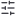

# Zulip icons

86 icons exported from Figma. Each SVG carries its source name and
description (where available) as `<title>`/`<desc>` in the file itself; the
same data is in [`manifest.json`](manifest.json).

Regenerate with `npm run export` (needs a Figma token — see below).

| Icon | Name | Description |
| :--: | ---- | ----------- |
|  | `arrow-left` | — |
|  | `asterisk-rectangle` | — |
|  | `at` | — |
|  | `at-not` | — |
|  | `attachment` | — |
|  | `bell-outline-marker` | — |
|  | `bot` | — |
|  | `bot-chat` | — |
|  | `box` | — |
|  | `calendar` | — |
|  | `cancel` | — |
|  | `chat-line` | — |
|  | `chat-line-graph` | — |
|  | `chat-z` | — |
|  | `check` | — |
|  | `chevron-down` | — |
|  | `chevron-down-square` | — |
|  | `chevron-left` | — |
|  | `chevron-right` | — |
|  | `chevron-up` | — |
|  | `code` | — |
|  | `cog` | — |
|  | `copy` | — |
|  | `document` | — |
|  | `download` | — |
|  | `edit-square` | — |
|  | `emoji` | — |
|  | `equal` | — |
|  | `expand` | — |
|  | `face-frame` | — |
|  | `feed` | — |
|  | `filter` | — |
|  | `github` | — |
|  | `globe` | — |
|  | `group` | — |
|  | `hash` | — |
|  | `help` | — |
|  | `icon` | — |
|  | `inbox` | — |
|  | `incoming` | — |
|  | `invisible` | — |
|  | `key-outline` | — |
|  | `laugh` | — |
|  | `line-height-big` | — |
|  | `line-height-small` | — |
|  | `link` | — |
|  | `link-2` | — |
|  | `list-restart` | — |
|  | `lock` | — |
|  | `locked-outline` | — |
|  | `mail` | — |
|  | `message` | Lucide |
|  | `mic` | https://feathericons.com/?query=mic |
|  | `mic-off` | https://feathericons.com/?query=mic |
|  | `move` | — |
|  | `open-external` | — |
|  | `outgoing` | — |
|  | `panel-left` | — |
|  | `panel-left-dashed` | — |
|  | `panel-right` | — |
|  | `panel-right-dashed` | — |
|  | `plus` | https://feathericons.com/?query=plus 2px stroke |
|  | `plus-square` | — |
|  | `profile` | — |
|  | `refresh` | — |
|  | `send` | — |
|  | `send-visible` | — |
|  | `settings` | — |
|  | `settings-3` | — |
|  | `share-screen` | https://feathericons.com/ |
|  | `star` | — |
|  | `star-badge` | — |
|  | `text-big` | — |
|  | `text-small` | — |
|  | `tiem` | — |
|  | `triangle-down` | — |
|  | `unlock` | — |
|  | `upload-hdd` | — |
|  | `user-circle` | — |
|  | `user-settings` | — |
|  | `users` | — |
|  | `vdots` | — |
|  | `video` | https://feathericons.com/?query=mic |
|  | `video-off` | https://feathericons.com/?query=mic |
|  | `visible` | — |
|  | `warning` | — |

## Regenerating

1. Create a Figma personal access token (Settings → Security → Personal access
   tokens) with file read access.
2. `echo 'FIGMA_TOKEN=figd_...' > .env.local`
3. `npm run export`
